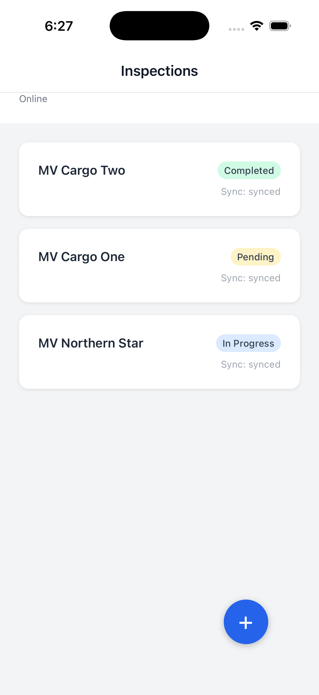
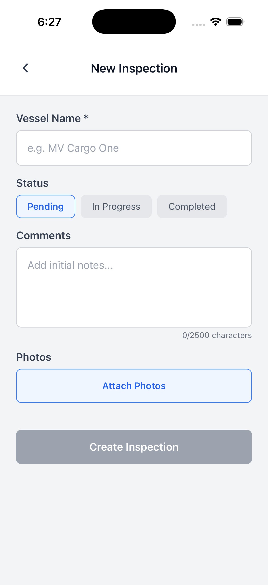
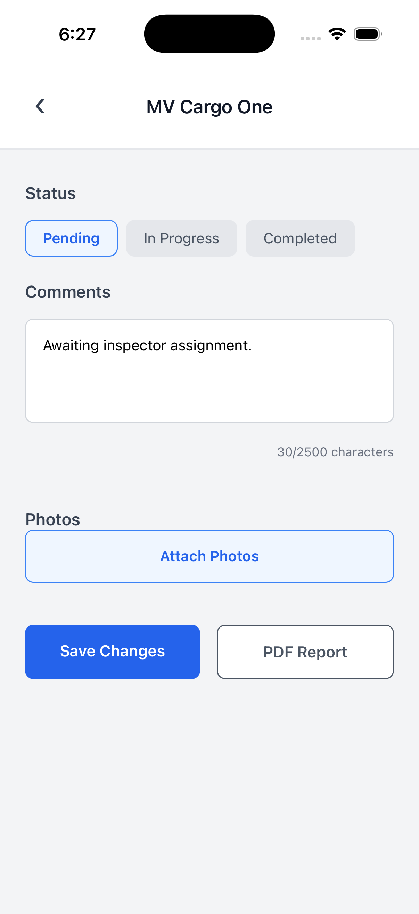
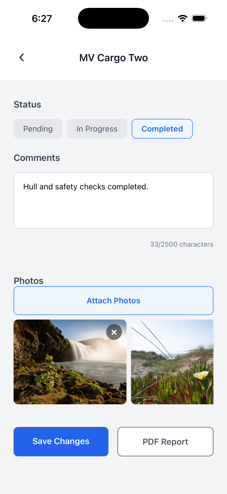
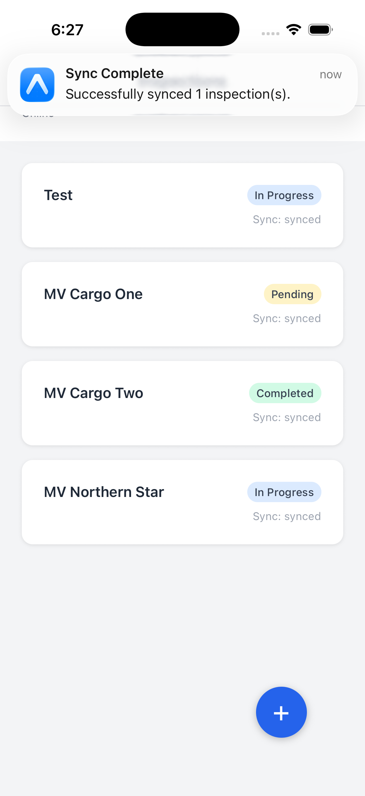

# Vessel Inspections

An offline React Native mobile app for managing vessel inspections.

## Screenshots

<p align="center">
  
  
  
  
  
</p>

## Overview

This app lets marine inspectors record vessel inspections completely offline. Data and photos are saved on your device and automatically uploaded to the server when you get your internet connection back.

## Features

* **Works Offline**: Read and write inspection reports without an internet connection.
* **Background Sync**: Changes are saved in a queue and automatically sent to the server in the background when the phone connects to a network.
* **Local Photo Storage**: Add multiple photos to inspections. Images are copied and saved safely on the phone.
* **State Management**: Uses Redux Toolkit to keep track of data, and Redux-Saga to handle background tasks and sync retries.

## Technology Stack

| Category         | Technology                                      |
|------------------|-------------------------------------------------|
| **Framework**    | React Native (0.86), Expo (SDK 57)              |
| **Navigation**   | Expo Router                                     |
| **Database**     | WatermelonDB                                    |
| **State**        | Redux Toolkit, Redux-Saga                       |
| **UI**           | Vanilla React Native StyleSheet, FlashList      |
| **Testing**      | Jest, Testing Library React Native, Detox       |

## Requirements

* Node.js (v18 or newer recommended)
* npm or yarn
* Expo CLI
* iOS Simulator or Android Emulator

## Installation

1. Clone the repository and go to the project folder.
2. Install the packages:
   ```bash
   npm install
   ```

## Running Locally

Start the Expo development server:

```bash
npm run start
```

Or run the app directly on a specific platform:

To run on iOS simulator:
```bash
npm run ios
```

To run on Android emulator:
```bash
npm run android
```

## Architecture

The code is organized into clear folders so everything stays neat and easy to find:

* **`src/app/`**: The screen routes for Expo Router.
* **`src/features/inspections/`**: All the code for the inspections feature (UI components, state, and background tasks).
* **`src/database/`**: Database setup and models that talk to SQLite to save data.
* **`src/api/`**: The fake API that acts like a real server.

### State Management

* **Redux Setup**: Redux Toolkit manages the app's state, keeping track of the inspection list, sync status, and internet connection.
* **Redux-Saga**: Manages complex background tasks:
  * `watchConnectivity`: Listens for network changes and starts a sync when the internet is back.
  * `watchLocalInspections`: Listens to WatermelonDB to keep the app's memory up to date.
  * `syncPendingInspections`: Sends any unsaved items to the API one by one.

### Offline Strategy

The app uses **WatermelonDB** for performance and saving data locally. When an inspection is created or updated:
1. The app sends an update to Redux.
2. A background task saves it to WatermelonDB and marks it as "pending".
3. WatermelonDB automatically updates the screen with the new data.
4. When the app detects an internet connection, a background task uploads all pending records to the server.

### Error Handling

* **API Errors**: The fake API checks that the data is correct. If it's wrong, the app catches the error and marks the item as "failed".
* **Connection Loss**: Detected automatically, so the app switches to local saving without any issues.
* **Sync Fails**: Items that fail to upload stay in the database so you can try again later.

### Trade-offs

* **Redux-Saga vs RTK Query**: We picked Redux-Saga because it gives us more control over offline syncing.
* **WatermelonDB vs SQLite/Realm**: WatermelonDB is much faster for large lists and updates the UI automatically, which basic SQLite doesn't do.
* **Last-Write-Wins**: Right now, the last save simply overwrites the old one. A real-world app would need a better way to handle editing conflicts.

## Testing

Run unit tests using Jest:

```bash
npm test
```

For full app testing, we use Detox. Make sure your simulator is running before starting Detox tests.

## Assumptions

*   **API Structure:** Assumes a standard RESTful API structure where endpoints handle standard JSON payloads for syncing.
*   **Authentication:** Assumes the user is already authenticated and an auth token is securely stored (authentication flow is mocked/bypassed for this exercise).
*   **Media Handling:** Assumes the backend supports multipart/form-data for photo uploads.

## Known Limitations

*   **Conflict Resolution:** Currently utilizes a "last-write-wins" strategy. In a production environment with multiple inspectors on the same vessel, a more robust conflict resolution strategy (like versioning or operational transformation) would be required.
*   **Photo Deletion:** The current flow supports attaching photos but does not fully support deleting local photos from the device's file system once attached.
*   **Mocked Endpoints:** The API is currently mocked. A real backend would need to handle the schema and validation.

## License

This project is licensed under the MIT License. See the `LICENSE` file for details.
